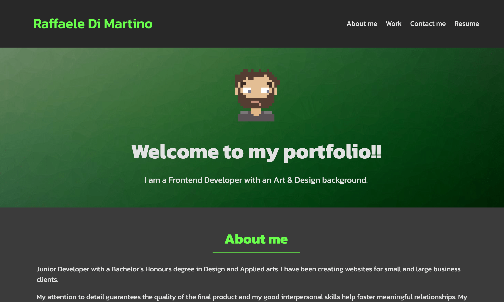
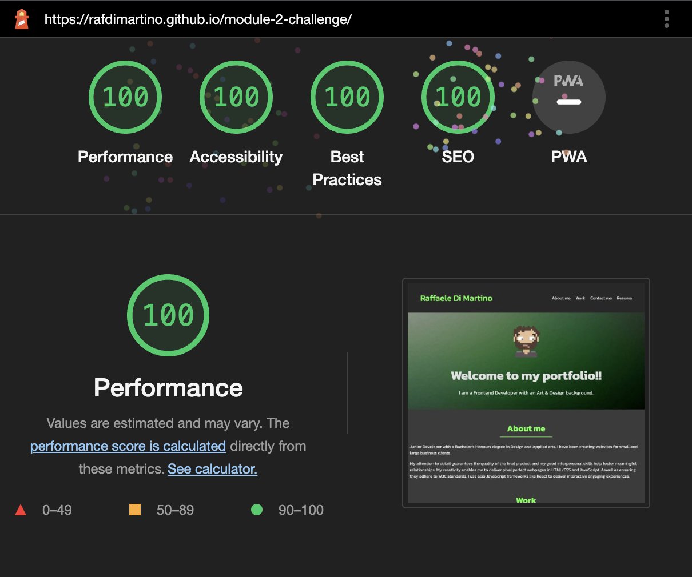

# Portfolio Page - challenge

## Description
In this assignement my task was to create a Personal Portfolio Webpage by practicing with: 

- CSS flexbox 
- CSS grid 
- CSS variables.
- CSS media queries

Also the page follow the mobile first design principles and it is fully responsive and adapts to any viewports

### Link to the deployed application 
https://rafdimartino.github.io/module-2-challenge/

## Tests
This application has been tested with google lighthouse, the average test results are all 100%

## Installation
N/A

## Usage
The portfolio page is deployed on Github Pages so you can access it by clicking [here](https://rafdimartino.github.io/module-2-challenge/)

## Credits
N/A

## License
Please refer to the LICENSE in the repo.
